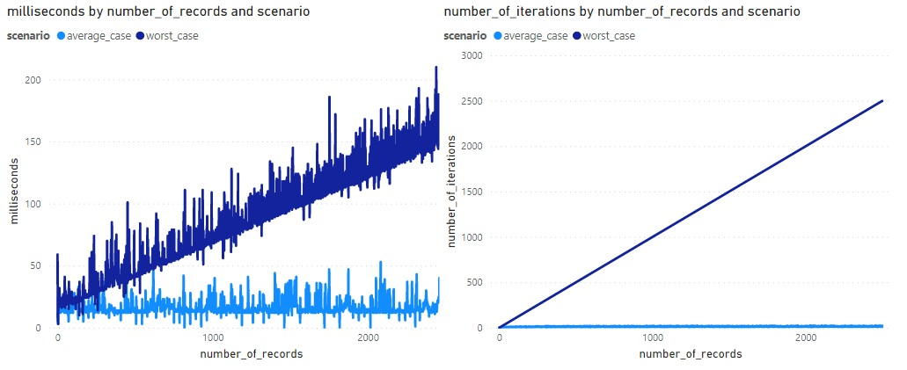

# K-D Tree

This is a Scala implementation of a [K-D Tree](https://en.wikipedia.org/wiki/K-d_tree). The Tree is persisted as a binary file on disk.

## Motivation
Being inspired by SQL Server's [spatial index](https://docs.microsoft.com/en-us/sql/relational-databases/spatial/spatial-indexes-overview?view=sql-server-ver15#:~:text=SQL%20Server%20supports%20spatial%20data,such%20as%20geometry%20or%20geography.), I wanted to learn how spatial indexes work under the hood. Although the algorithm used here is much simpler than SQL Server's, it does provide an efficient way of indexing spatial (more generally: multi-dimensional) data. This project also taught me how to serialize and store arbitrary data on disk.

## Tree and Node structure
Each Node contains pointers (byte offsets) to its `left` and `right` children. Pointer values of -1 indicate that there are no children. The location of each Node (`point`, being a K-dimensional array of coordinates), as well as its data (`record`, which is a string of any size) is stored in the Node itself. Because the `record` can be of any size, the Node also has a field that indicates its `size` (as counted by all bytes of the serialized Node). 

## API and Usage 
The database (Tree) supports one method only: `insert`. This method requires two parameters: `location` (i.e. coordinates) and `record` (i.e. data). When a new Node is inserted, its content is serialized and appended to the binary file. Then, the parent of the inserted Node is identified, and updated with the pointer (either `left` or `right`) to its (new) child Node.

## Performance
I've investigated the performance of the search algorithm. I used two higher-level methods:
- **[average-case]** `insertRandom`: inserts a Node _at a random location_. Inserting at random locations in the Tree, means that (by and large) the Nodes will be distributed appropriately.
- **[worst-case]** `insertWorstCase`: inserts a Node _at a point which is slightly 'higher' than the previously inserted Node_. This boils down to inserting Nodes only at the 'edges' of the Tree. Another way to phrase it: the Tree ends up being a giant linked list, because every Node will be the (right) child of the previous Node.  

In the Main file, two Trees are built (using above methods) to inspect average- and worst-case performance, respectively. Each Tree starts empty, and for every `insert`, we record:
- The number of miliseconds required to perform the insert (`miliseconds`)
- The number of ancestors the inserted Node has (`number_of_iterations`)  

The results are shown below (and can be found in [resources/](resources/)):

Clearly, for the worst-case scerario, the time required to insert a Node is directly proportional to the number of existing Nodes (records) in the Tree. For the average-case scenario, the logarithmic scale shows a more-or-less flat line, indicating its `O(log n)` time complexity:

##### Many disk reads
In general, the performance of the Tree is quite poor. This is probably due to the large number of disk reads required to find a particular Node. This finding is consistent with the motivation to use [B-Trees](https://en.wikipedia.org/wiki/B-tree) for storing an index on disk. 

